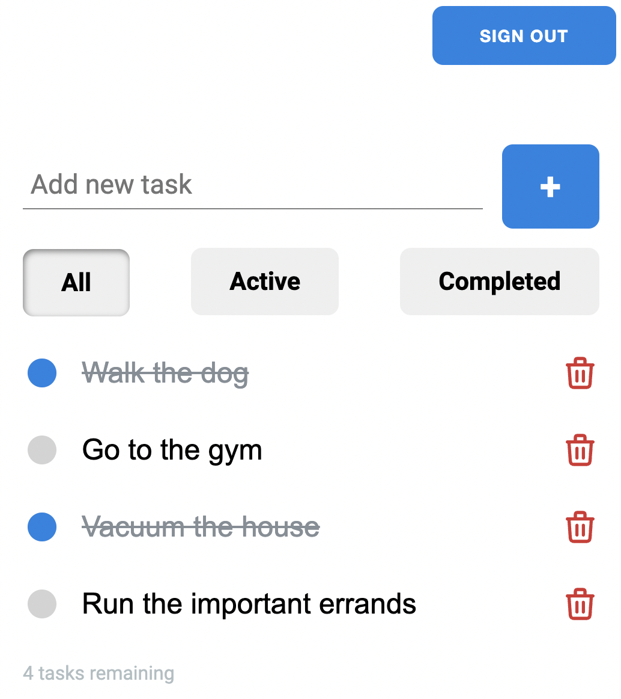

## A todo web app

- [General info](#general-info)
- [Technologies](#technologies)
- [Setup](#setup)

## General info

This repository holds the source code for a simple todo web app.

## Technologies

Project is created with:

- [AWS Amplify for auth, storage, and deployment](https://aws.amazon.com/amplify/)
- React: 17.0.2
- Framer Motion: 4.1.17
- GraphQL

## Setup

To run this project, install it locally using npm:

```
$ cd ./todo-app-react
$ npm install
$ npm start
```

## Demo

The live demo is deployed on AWS Amplify: https://main.dwuhwwtuh84l8.amplifyapp.com/


